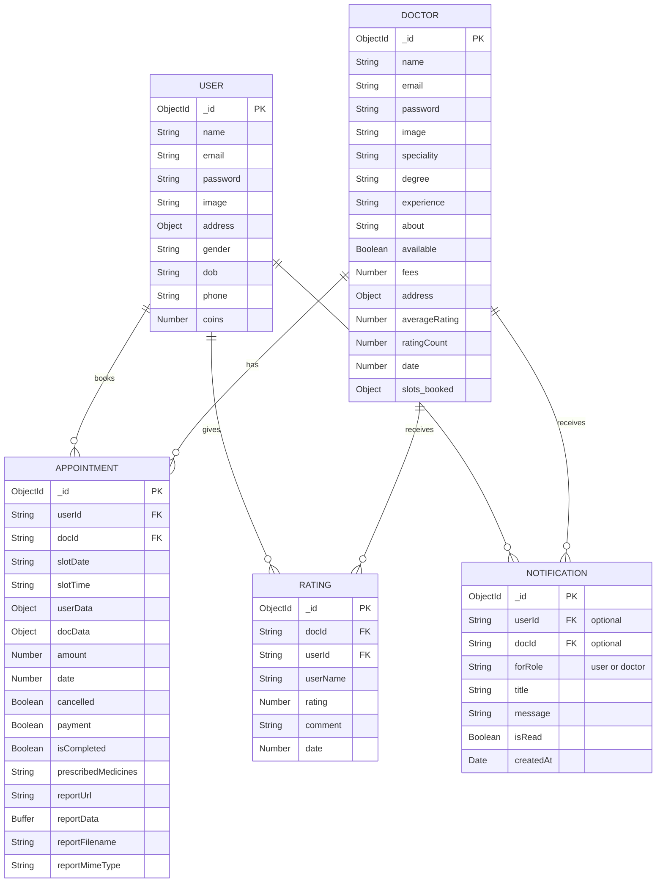

# Doctor Appointment System - ER Diagram

```mermaid
erDiagram
    USER ||--o{ APPOINTMENT : books
    USER ||--o{ RATING : gives
    USER ||--o{ NOTIFICATION : receives
    DOCTOR ||--o{ APPOINTMENT : has
    DOCTOR ||--o{ RATING : receives
    DOCTOR ||--o{ NOTIFICATION : receives

    USER {
        ObjectId _id PK
        String name
        String email
        String password
        String image
        Object address
        String gender
        String dob
        String phone
        Number coins
    }

    DOCTOR {
        ObjectId _id PK
        String name
        String email
        String password
        String image
        String speciality
        String degree
        String experience
        String about
        Boolean available
        Number fees
        Object address
        Number averageRating
        Number ratingCount
        Number date
        Object slots_booked
    }

    APPOINTMENT {
        ObjectId _id PK
        String userId FK
        String docId FK
        String slotDate
        String slotTime
        Object userData
        Object docData
        Number amount
        Number date
        Boolean cancelled
        Boolean payment
        Boolean isCompleted
        String prescribedMedicines
        String reportUrl
        Buffer reportData
        String reportFilename
        String reportMimeType
    }

    RATING {
        ObjectId _id PK
        String docId FK
        String userId FK
        String userName
        Number rating
        String comment
        Number date
    }

    NOTIFICATION {
        ObjectId _id PK
        String userId FK "optional"
        String docId FK "optional"
        String forRole "user or doctor"
        String title
        String message
        Boolean isRead
        Date createdAt
    }
```
